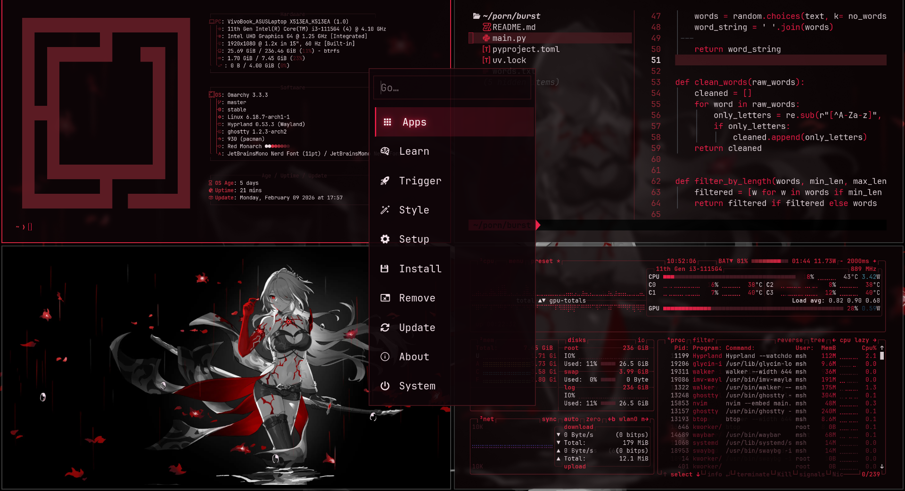

# Red Monarch Theme

## Preview



A sleek red-themed color scheme for Omarchy.

## Installation

1. Place this directory in `~/.config/omarchy/themes/`
2. Configure your Omarchy settings to use `red-monarch`

## Features

- **Primary Color**: Deep red palette
- **Accent Colors**: Complementary reds and gold tones
- **Customizable**: Modify colors in `theme.json`

## Files

- `theme.json` - Theme configuration
- `README.md` - This file

## Usage

Set in your Omarchy config:

```json
{
  "theme": "red-monarch"
}
```

nvim theme: [monarch.nvim](https://github.com/kamatealif/monarch.nvim.git)
